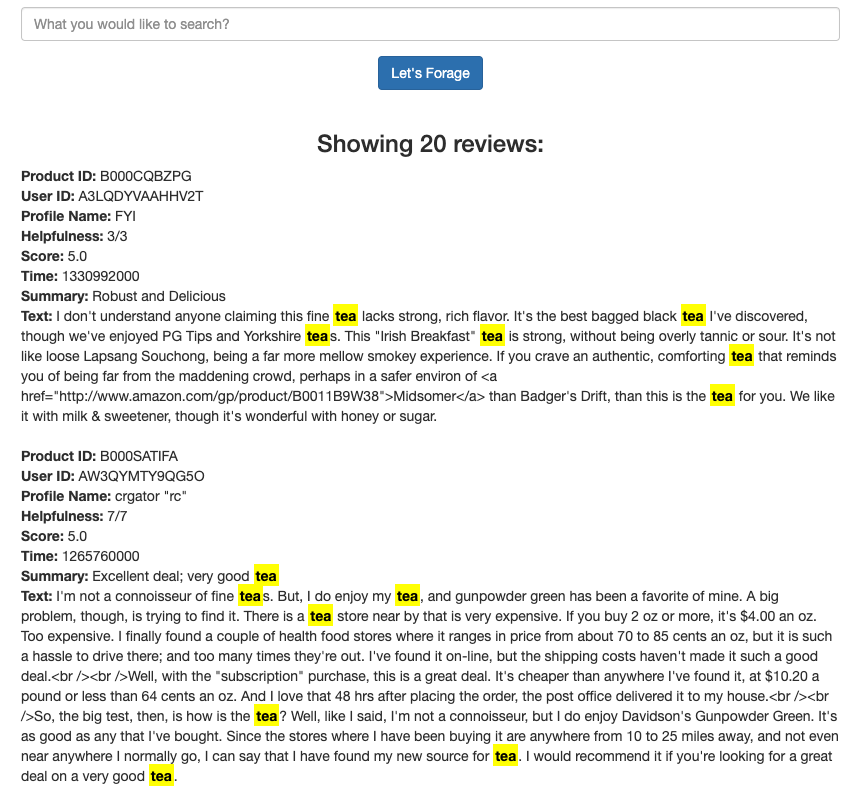

# forager

A search engine to search gourmet food reviews. It returns the top K
reviews that have the highest overlap with the input query.

This app is hosted on [heroku](https://happy-foraging.herokuapp.com). 

### description
**forager** takes query as an input and outputs all the reviews which includes one or more query terms. If more than 20 such reviews exist, top 20 reviews will be returned based on a scoring mechanism.

```
Score(D, Q) = Q ⋂ D
(i.e. # tokens matching between Query(Q) & Document(D) normalized by query
length the number of tokens in the given query).

e.g. given Q = { cat, processed, bad, good } and a document described by the
following:
product/productId: B001E4KFG0
review/userId: A3SGXH7AUHU8GW
review/profileName: delmartian
review/helpfulness: 1/1
review/score: 5.0
review/time: 1303862400
review/summary: Good Quality Dog Food
review/text: I have bought several of the Vitality canned dog food products and
have found them all to be of good quality. The product looks more like a stew
than a processed meat and it smells better. My Labrador is finicky and she
appreciates this product better than most.

Score = 2 / 4 = 0.5

Ties between scores is resolved using review/score for the document.
```
Currently, only exact match of query term is supported. 

### prerequisites
- Python 3.7.3 

### execute
```bash
cd forager
mkvirtualenv -p python3 happy-foraging
pip install -r requirements.txt  
flask run
```
Open the url in your browser:  
`http://127.0.0.1:5000`


Enter a search term. For example: `tea`  
It will return all the documents having term `tea`



### next-milestone
- case insensitive comparison
- consider all word forms (using python library `nltk`)
- remove stop words from query
- make fetching faster (by using better memory storage)
- add tests
- enable searching on all the fields of review
- pagination
- better UI